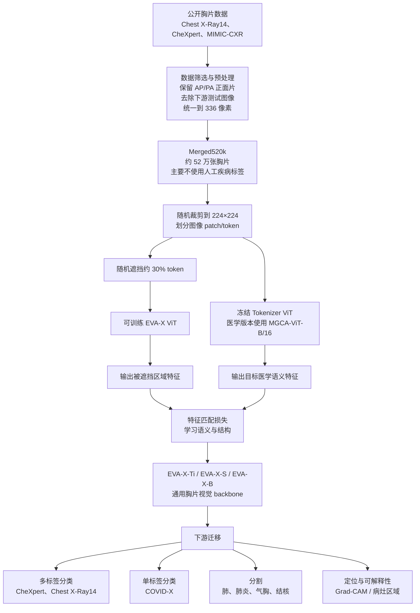
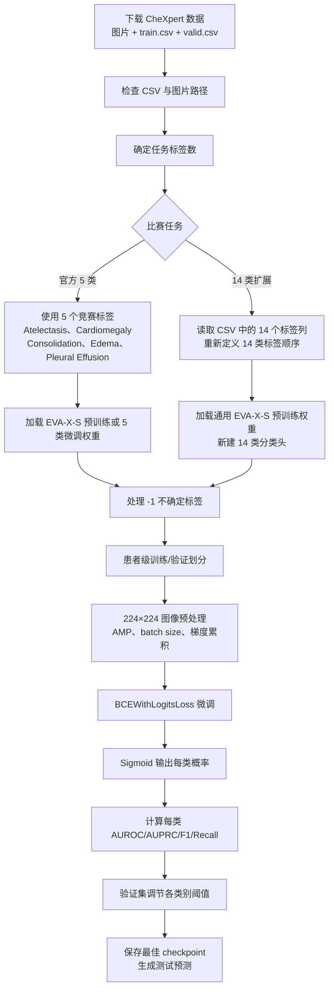

# EVA-X 项目总结与流程图

更新时间：2026-09-21

## 一句话总结

EVA-X 是一个专门面向医学 X 光片的视觉基础模型项目。它先使用大量没有人工疾病标签的胸片进行自监督预训练，学习胸片中的解剖结构、纹理、病灶和空间关系；然后把预训练好的 EVA-X 视觉编码器迁移到胸片分类、分割、定位和可解释性分析任务中。

因此，EVA-X 的核心价值不是提供一个固定的 5 类或 14 类分类器，而是提供一个已经学会“如何看胸片”的通用视觉 backbone。

## 1. EVA-X 要解决什么问题

传统胸片深度学习项目通常存在几个问题：

- 医生标注成本高，带标签数据有限；
- 不同医院、设备和人群之间存在分布差异；
- 一个模型通常只针对一个数据集或一个疾病任务；
- 普通 ImageNet 预训练模型没有充分利用 X 光图像的特殊结构；
- 分类模型可能会关注文字标记、边缘或设备，而不是病灶本身。

EVA-X 的思路是：

```text
先用大量未标注胸片学习通用胸片特征
              ↓
再用少量有标签数据训练具体任务
              ↓
减少下游任务对人工标注和从头训练的依赖
```

## 2. EVA-X 项目具体做了什么

### 2.1 构建胸片预训练数据

论文的预训练数据主要来自：

- Chest X-Ray14；
- CheXpert；
- MIMIC-CXR。

作者将符合条件的正面胸片合并成约 **520,000 张**的预训练数据集，称为 `Merged520k`。预训练阶段主要使用图像本身，不使用疾病标签，也不使用放射科报告中的病理信息。

为了避免评估泄漏，论文说明后续测试使用的图像不会被放入预训练集合中。数据处理上，作者主要保留 AP/PA 正面片，去除侧位片，并先将图像缩放到 336 像素，再随机裁剪为 224×224。

### 2.2 设计 X 光专用的自监督预训练

EVA-X 使用 Vision Transformer，核心是一个双 ViT 结构：

```text
可训练的 EVA-X ViT
        +
冻结的 Tokenizer ViT
```

其中：

- EVA-X ViT 是需要学习的主模型；
- Tokenizer 是固定的教师式视觉编码器；
- 医学图像版本使用 MGCA 训练的 ViT-B/16 作为 Tokenizer；
- Tokenizer 用于产生具有医学语义的目标特征；
- EVA-X 需要从被遮挡的图像中恢复或匹配这些特征。

EVA-X 将两类预训练思想结合起来：

1. **Mask Image Modeling**
   - 随机遮挡一部分图像 token；
   - 让模型根据剩余的胸片内容学习被遮挡区域；
   - 重点学习局部结构、纹理和空间关系。

2. **语义特征匹配**
   - 使用冻结 Tokenizer 提供目标特征；
   - 让 EVA-X 对被遮挡区域输出的特征接近 Tokenizer 的特征；
   - 重点学习疾病相关的语义表示。

官方论文中使用的 mask ratio 为 0.3，即随机替换大约 30% 的图像 token。需要注意，EVA-X 的论文将这种方法描述为结合对比学习思想与 Mask Image Modeling 的 X 光自监督策略；实际代码中核心表现为被遮挡 token 的特征匹配。

### 2.3 训练不同大小的模型

EVA-X 提供三个规模：

| 模型 | 架构 | 参数量 | 适用场景 |
|---|---|---:|---|
| EVA-X-Ti | ViT-Ti/16 | 6M | 显存有限、快速原型、部署 |
| EVA-X-S | ViT-S/16 | 22M | 效果与显存的平衡，推荐主线 |
| EVA-X-B | ViT-B/16 | 86M | 追求上限、显存充足 |

它们的共同特点是：

- 输入默认以 16×16 patch 划分图像；
- 默认输入分辨率为 224×224；
- 使用胸片领域预训练权重；
- 下游任务只需要新增或替换任务头。

### 2.4 迁移到下游任务

预训练完成后，EVA-X 不直接输出疾病名称，而是输出胸片的视觉特征。下游任务再添加一个简单的任务头。

对于多标签分类，官方方法是：

```text
最后一层 ViT token
        ↓
平均池化
        ↓
线性分类层
        ↓
每个疾病一个 logit
        ↓
Sigmoid 得到每类概率
```

例如 CheXpert 五类任务：

```text
EVA-X-S 特征
        ↓
Linear(hidden_dim, 5)
        ↓
5 个独立疾病概率
```

如果改成 CheXpert 14 类任务：

```text
EVA-X-S 特征
        ↓
Linear(hidden_dim, 14)
        ↓
14 个独立疾病概率
```

多标签任务通常使用 `BCEWithLogitsLoss`，而不是 `Softmax`。因为一张胸片可以同时出现多个异常，例如肺水肿和胸腔积液可以同时为阳性。

## 3. EVA-X 官方项目流程图



## 4. 你们 CheXpert 赛题中的实际流程

你们不需要重新执行 EVA-X 的大规模预训练。实际应该使用官方已经发布的 EVA-X 权重，然后针对赛题标签进行微调。



## 5. 你们项目中需要使用 EVA-X 的哪一部分

你们的目标是胸片多标签分类，因此只需要使用 EVA-X 的以下部分：

```text
需要：
    EVA-X-S 模型结构
    EVA-X-S 通用预训练 checkpoint
    timm / pytorch-image-models
    图像预处理
    分类 head
    多标签损失和评估代码

不需要：
    重新训练 52 万张胸片
    重新训练 Tokenizer
    重新执行大规模自监督预训练
    使用 EVA-X 的分割代码
    使用 EVA-X 的 Grad-CAM 代码作为训练前提
```

## 6. 5 类和 14 类在 EVA-X 中的区别

### 5 类

官方 EVA-X CheXpert 配置选择了 CheXpert 竞赛中的 5 个观察项：

```text
Atelectasis
Cardiomegaly
Consolidation
Edema
Pleural Effusion
```

使用官方 5 类微调 checkpoint 时，分类头输出为 5。

### 14 类

14 类不是重新给图像人工打标签，而是读取 CheXpert 原始 CSV 中已有的 14 个观察项，并完成以下修改：

1. 数据集读取器选择 14 个标签列；
2. 保持固定的标签顺序；
3. 将分类头输出从 5 改为 14；
4. 处理每一类的 `-1` 不确定标签；
5. 计算 14 类的 AUROC/AUPRC/F1/Recall；
6. 对 5 类 checkpoint 的分类头进行丢弃并重新初始化。

更推荐使用通用 EVA-X-S 预训练权重直接训练 14 类新分类头，因为这样不会把 5 类任务的输出头错误地带入 14 类任务。

## 7. EVA-X 项目的主要成果

根据官方论文和仓库：

- 预训练使用超过 520,000 张公开胸片；
- 不依赖人工疾病标签完成预训练；
- 结合语义学习和几何/结构学习；
- 提供 Ti、S、B 三种规模；
- 在 Chest X-Ray14、CheXpert、COVID-X 等任务上进行迁移评估；
- 覆盖多标签分类、单标签分类、分割和定位；
- EVA-X-S 在官方 CheXpert 验证配置中报告的 mAUC 为 90.1；
- EVA-X-Ti 在较小模型规模下也能保持较强性能。

这些数字是论文和官方仓库在其数据划分、训练环境和标签策略下得到的结果，不代表在你们自定义的 14 类配置中可以直接复现。

## 8. EVA-X 不是什么

需要避免几个误解：

- EVA-X 不是一个自动修改 `train.csv` 的工具；
- EVA-X 不会自动把 5 类标签变成 14 类；
- EVA-X 预训练权重不是已经完成所有比赛任务的最终模型；
- EVA-X 不等于临床诊断系统；
- EVA-X 的官方 5 类 checkpoint 不能直接当成 14 类模型；
- EVA-X 的论文指标不能直接保证你们赛题的测试分数。

更准确的理解是：

```text
EVA-X = 胸片视觉特征提取器
比赛分类器 = EVA-X backbone + 你们的标签读取器 + 新分类头 + 微调
```

## 9. 对当前项目的建议

### 推荐主线

```text
EVA-X-S 通用预训练权重
        ↓
CheXpert 5 类或 14 类标签
        ↓
重新初始化分类头
        ↓
RTX 4060 Ti / 4060 本地微调
        ↓
固定患者级划分
        ↓
AUROC、AUPRC、F1、Recall
```

### 推荐实验顺序

1. 先用 5 类任务跑通数据读取、前向传播、loss 和 AUROC；
2. 再扩展到 14 类；
3. 固定患者级划分；
4. 比较 `U-Zero`、`U-One` 和 `U-Ignore`；
5. 调节每个类别的预测阈值；
6. 最后再尝试高分辨率、冻结 backbone 和模型集成。

## 10. 官方来源

- EVA-X 官方仓库：[https://github.com/hustvl/EVA-X](https://github.com/hustvl/EVA-X)
- EVA-X 论文：[https://arxiv.org/abs/2405.05237](https://arxiv.org/abs/2405.05237)
- EVA-X 正式发表版本：[https://www.nature.com/articles/s41746-025-02032-z](https://www.nature.com/articles/s41746-025-02032-z)
- EVA-X-S 通用权重：[https://huggingface.co/MapleF/eva_x/blob/main/eva_x_small_patch16_merged520k_mim.pt](https://huggingface.co/MapleF/eva_x/blob/main/eva_x_small_patch16_merged520k_mim.pt)
- EVA-X-S CheXpert 五类微调权重：[https://huggingface.co/MapleF/eva_x/blob/main/eva_x_small_patch16_merged520k_mim_chexpert_ft.pth](https://huggingface.co/MapleF/eva_x/blob/main/eva_x_small_patch16_merged520k_mim_chexpert_ft.pth)
- `timm` / `pytorch-image-models`：[https://github.com/huggingface/pytorch-image-models](https://github.com/huggingface/pytorch-image-models)
